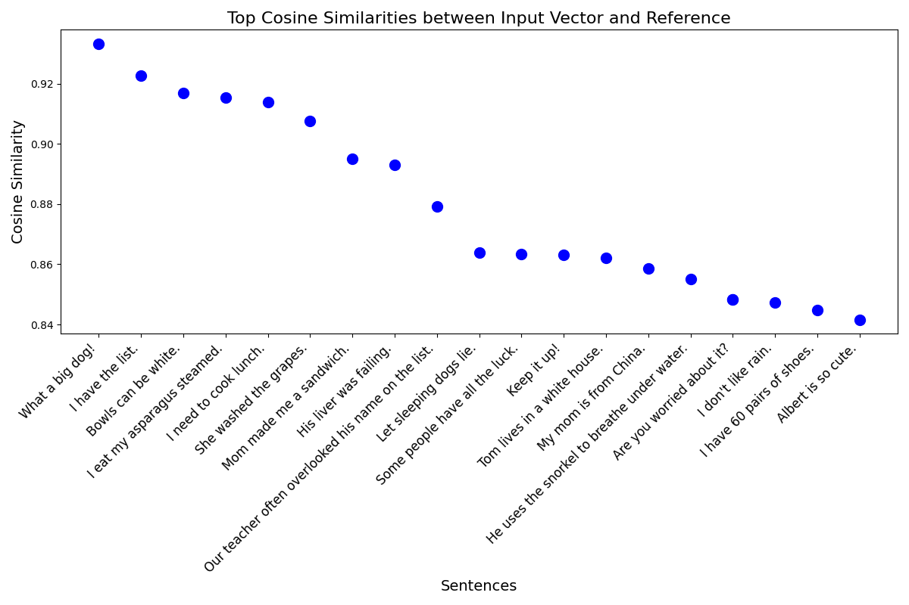

# NLP Similarity Score

A Python-based project for calculating similarity scores using Natural Language Processing (NLP). This implementation is designed to be simple, utilizing a pre-trained NLP model to vectorize sentences and store the resulting vectors in a [Pandas](https://pandas.pydata.org) DataFrame. The project does not rely on third-party databases and can be easily adapted to use a vector database if needed.

## Description

This project demonstrates how to calculate similarity scores between sentences using vectorized data. The sentences are read from a CSV file, vectorized using an NLP model, and then stored along with metadata in a Pandas DataFrame. The vectors are saved in a serialized format (using pickle) for efficient storage and retrieval. You can search for similar sentences in the dataset, and visualize the results using scatter plots.

## Features

 - *Sentence Vectorization:* Reads sentences from `data/random_sentences.csv` and vectorizes them using a pre-trained NLP model.
 - *Efficient Storage:* Vectors and metadata are stored in a pickled Pandas DataFrame, making the implementation lightweight and fast. This can be replaced with a vector database for scalability.
 - *Similarity Search:* Allows you to search for sentences similar to a given input sentence using cosine similarity.
 - *Visualization:* Generates a scatter plot to visualize similarity scores between sentences.



## Usage

### Vectorize the Dataset

```bash
$ python3 vectorize_sentences.py 
  RowID                                               Text Metadata                                            vectors
0  id-1  It’s four a.m. and both of us would rather be ...     md-1  [-0.63189316, -0.32086504, -0.19091547, 0.1911...
1  id-2            This is when it starts getting serious.     md-2  [-0.50462574, -0.13868034, 0.03731264, -0.2865...
2  id-3                              My mom is from China.     md-3  [-0.8505667, 0.12654176, 0.35941458, 0.0791408...
3  id-4                        I eat my asparagus steamed.     md-4  [0.1938362, -0.28357005, 0.025085073, 0.203929...
4  id-5        He uses the snorkel to breathe under water.     md-5  [-0.11299684, -0.21625482, 0.16159831, -0.1710...

DataFrame saved to `data/df.pkl`
```

### Perform a Similarity Search

```bash
$ python3 score.py -t "I don't like snow" -l 3
    RowID                       Text Metadata                                            vectors  Similarity
21  id-22         I don't like rain.    md-22  [-0.41069135, -0.036516473, 0.1366242, 0.07364...    0.976623
46  id-47  I have 60 pairs of shoes.    md-47  [-0.5448569, 0.07107707, 0.35270178, -0.047913...    0.915285
10  id-11      I need to cook lunch.    md-11  [0.10649221, -0.040051132, 0.09312568, 0.01905...    0.914074
```

You can also generate a scatter plot to visualize the similarity scores:

```bash
# Optionally, you can also generate a scatter plot:
$ python3 score.py -t "I cook lunch" -l 20 -f "data/similarity_plot.png"
```
